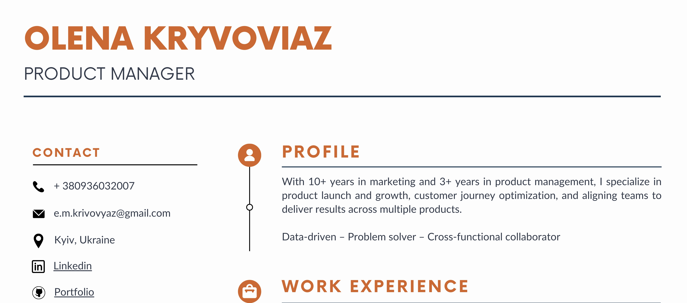

# PORTFOLIO

Hello everyone! My name is Olena Kryvoviaz.

I’m a Product Manager with a strong background in marketing and a passion for building customer-centric digital products. My experience spans across Israeli and European PropTech and startup ecosystems, where I’ve led cross-functional teams and managed products from ideation to launch and growth. I’m especially driven by product discovery, data-informed decision-making, and continuous product improvement. Feel free to explore my portfolio to get a sense of my skills through example projects based on case studies and open-source data.

# GET TO KNOW ME

Click below to explore my CV

### MY PROFESSIONAL EXPERIENCE 

<a href="https://www.linkedin.com/in/elena-krivovyaz-83660b6a/">LinkedIn</a>
  
 Product and Marketing Manager with 5+ years cross-team management experience. Currently, I lead a portfolio of three products across Israeli and European markets at REALTY BUNDLES. Under my leadership, our product ecosystem has seen significant growth, leveraging data-driven decision-making, cross-functional collaboration, and go-to-market excellence. I thrive in scaling products, enhancing customer experience, and aligning teams around a shared vision.

# MY PAST PROJECTS

### [A/B Testing Case Study: Agent Dashboard Optimization](https://github.com/OlenaKryvoviaz/Portfolio/blob/main/Case%20Studies/AB_test_agents_account.md)
  
Key agent engagement metrics were analyzed to test whether automation and visual insights improved activity.
 
<li>Measured the number of new leads introduced.</li>

<li>Compared engagement and session duration across groups.</li>

<li>Assessed invoice download adoption.</li>

  <strong>Project Workflow</strong>: 
<ol type="1">
   
<li><strong>Problem & Hypothesis</strong>: Agent interviews revealed challenges with manual commission tracking and poor visibility into lead status. We hypothesized that automation and visual insights would increase engagement and lead generation.</li>
  
<li><strong>Experiment Design:</strong>Tested three variants – Base (original), V1 (automatic invoices), V2 (invoices + interactive performance graphs)..</li>
  
<li><strong>Data & Analysis</strong>: Split agents into groups and measured leads introduced, invoice downloads, engagement, and session duration. SQL queries were used for comparisons and correlations.</li>
 
<li><strong>Reporting</strong>: Results were consolidated into a <a href="https://github.com/OlenaKryvoviaz/Portfolio/blob/main/Case%20Studies/AB_test_agents_account.md">case study</a> highlighting key findings and recommendations for scaling.</li>

</ol>

  <strong>Conclusion</strong>:

<li>V1 showed <strong>+7% more leads</strong>, mainly due to improved invoice tracking</li>.

<li>V2 showed <strong>+19% more leads</strong>, with significant increases in engagement and session duration</li>.

<li>Correlations confirmed that both engagement and session duration are strongly linked to lead generation</li>.

  <strong>Key Skills</strong>:

 SQL
 A/B Testing
 User Research & UX Insight
 Product Data Analysis
 Experiment Design
 Reporting & Case Study Writing

[Dataset reference - Data generated randomly](https://docs.google.com/spreadsheets/d/1fg90CA7xKxxh_cIPLK0QFKU7xsfLxNy70F5nYP4d8zQ/edit?gid=0#gid=0)

April, 2025

### [Tableau Dashboard: Sales and Retention analysis](https://public.tableau.com/views/OlenaKryvoviazSalesandRetentionAnalysis/SalesandRetentionAnalysis?:language=en-US&:sid=&:redirect=auth&:display_count=n&:origin=viz_share_link)

Key sales and retention metrics were analyzed to highlight strengths and weaknesses and inform the growth strategy. 
 - Calculated Month-1, Month-2, and Month-3 retention rates for product users.
 - Segmented results by country.
 - Computed the average purchase value.
 - Calculated the average number of purchases per month.
 - Compiled actionable recommendations.
 
  <strong>Project Workflow</strong>: 

  <strong> 1. Data Cleaning </strong>: Identified outliers and validated value ranges for every column.
  <strong> 2. Data Processing and Calculation </strong>: Used SQL to calculate monthly retention by region ([Link to SQL queries](https://github.com/OlenaKryvoviaz/Portfolio/blob/main/SQL/Retention%20by%20Region.sql)), average purchase value, and monthly purchase frequency by region ([Link to SQL queries](https://github.com/OlenaKryvoviaz/Portfolio/blob/main/SQL/Av_Check_and_Purchases_per_Region.sql)).
  <strong> 3. Visualization </strong>: Built an interactive Tableau dashboard. Heatmaps and filters make the insights easy to explore.
  <strong> 4. Reporting: </strong> Documented insights and next steps.

  <strong>Conclusion</strong>:

Recommendations vary by region. Notable insights include:

  - Latin America. Purchase frequency and average order value are strong, but the user base is small. Identify key success factors in this market and scale acquisition efforts.
  - Eastern Europe has the highest average order value and strong retention. Focus on increasing purchase frequency through personalized promotions, loyalty programs, cross-sell and upsell offers, remarketing, push and email reminders, subscriptions or auto-refill, and gamification. Additional research is recommended to prioritize these initiatives.
  - East Asia boasts the best retention, but average order value and purchase frequency are middling. Enhance the product offer—upsell and bundle deals, free-shipping thresholds, premium product versions, loyalty-program bonuses for larger baskets, personalized recommendations, and limited-time discounts on higher-end products.

  <strong>Key Skills</strong>:

 SQL
 Tableau
 Product Data Analysis
 Retention Metrics
 Data Visualisations

[Dataset reference - Data generated randomly](https://docs.google.com/spreadsheets/d/1fg90CA7xKxxh_cIPLK0QFKU7xsfLxNy70F5nYP4d8zQ/edit?gid=0#gid=0)

April, 2025

